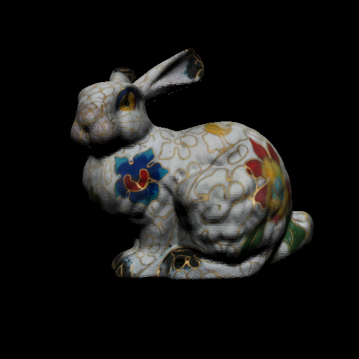

# PyEGL

Module to create renderings of meshes stored within PyTorch tensors on GPU.

```
defines = ['CONSTANT_SHADING', 'PHONG_SHADING', 'TEXTURE_SHADING']  # select one of the modes

pyegl.init(width, height, defines)
maps = pyegl.forward(intrinsics, pose, vertices_data, n_vertices, faces, n_faces)
pyegl.attach_texture(texture_path)  # attach if texture_shading is selected
pyegl.terminate()
```

Refer to [example](pyegl_test.py) for more details.


| rendered maps  |  to be returned |
| ------------- | ------------- |
|   |   |
| colors  | positions  |
|   |   |
| normals  | uv  |
|   |   |
| barycentrics  | vertex_ids  |


