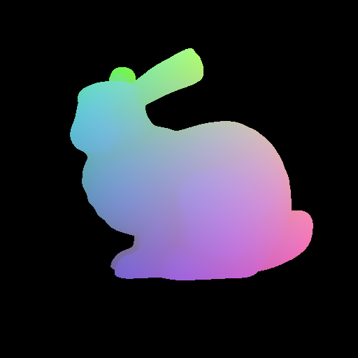
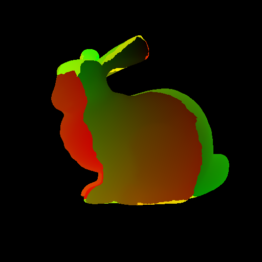

# PyEGL #

Module to create renderings of meshes stored within PyTorch tensors on GPU.

### Installation ###

1. First install required dependencies
- OpenGL/EGL
- CUDA
- Eigen (in `deps` folder as `eigen`)
- FreeImage
- Pytorch
- trimesh (optional)
- imageio (optional)

2. Update include and lib paths in [setup.py](setup.py) file
3. Then run
```
python setup.py install
```

### Demo ###

```
defines = ['CONSTANT_SHADING', 'PHONG_SHADING', 'TEXTURE_SHADING']  # select one of the modes

pyegl.init(width, height, defines)
maps = pyegl.forward(intrinsics, pose, vertices_data, n_vertices, faces, n_faces)
pyegl.attach_texture(texture_path)  # attach if texture_shading is selected
pyegl.terminate()
```

Refer to [example](pyegl_test.py) for more details.

| rendered maps                      | to be returned                   |
| ---------------------------------- | -------------------------------- |
|         |   |
| colors                             | positions                        |
|       |          |
| normals                            | uv                               |
|  |  |
| barycentrics                       | vertex_ids                       | 


